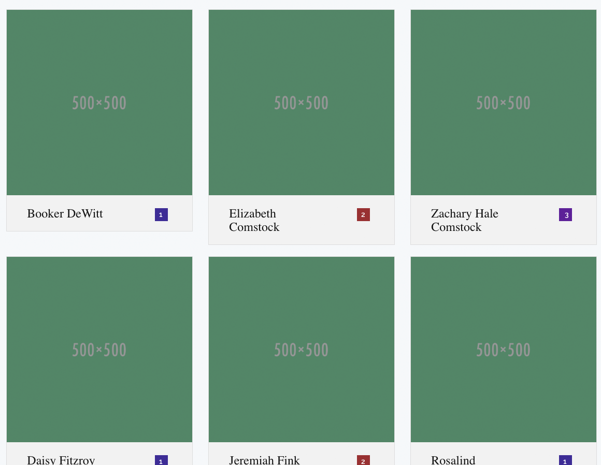
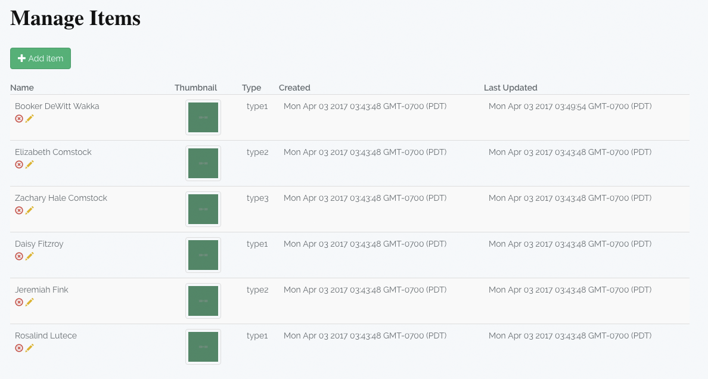
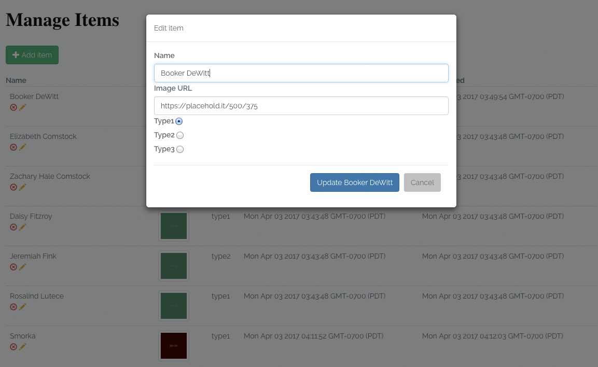

# Laravel CRUD Starter App

Extend this project as needed to build your own full stack web application or site. Or, use it as a reference if you're learning to build web apps in general or Laravel projects in particular.

## Demo instance

For convenience, this application has also been deployed via Laravel Forge to a VPS.

[Laravel CRUD Starter Demo Instance](https://cosmicwitness.com);

## Features

### Configurable splash screen

Greet your users, add login or sign-up buttons, sales pitches, etc here. Already configured to use parameters you set for header and contact info, and features a full width splashscreen style teaser image you could easily swap out with whatever you want.


### Responsive grid view for items

Leveraging bootstrap, Laravel Blade and a custom directive, you've already got a fully responsive grid view to start with.



### Admin-only CRUD Manager View

Easily configure the admin account(s) that should have access to the backend manager application. The admin app is protected by basic auth out of the box.



### Intuitive interface

The sleek and minimalist interface gets out of your way, but is still responsive and has a pleasant feel to it thanks to:

* Two way data binding thanks to Vue.js
* Subtle animations on modified, created, deleted items in the table view
* Robust error and success messaging framework that can be easily extended



## Overview

CRUD Starter is a full-stack application built leveraging:

* Laravel 5.4
* Vue 2.1.10
* Bootstrap CSS & JS

CRUD Starter allows visitors to view items in a responsive grid presentation. The application allows an admin user to access a special management console for performing CRUD operations on items via the internal items REST API.

This project is a good starting point if you're building an application or website that needs to publicly display privately managed entities, or if you're just trying to get a sense of what a CRUD app might look like in Laravel.

Since the admin route exposes sensitive information and capabilites, it is locked down via HTTP Basic Auth, leveraging Laravel's internal auth.basic middleware.

You can access the admin view using the special admin credentials:

```
demoadmin@Laravel.com / n6lbx6qoc%FWSIBb9@ox
```

**Please change this password to something long, complex and unique, that is not publicly exposed, in the AdminsTableSeeder.php file before deploying this app to anything resembling a production environment.**

This long and complex password is hashed via Laravel's Hash facade, which leverages Bcrypt under the hood, before it is stored in the database via the AdminsTableSeeder. This is done to ensure that, even if a security breach grants an attacker access to the database, user passwords are stored as non-reversible hashes.

## Design Considerations

I like to include detailed comments throughout the code that I write, such that another developer who is looking at my code can easily get up to speed, understand my thinking, and reference PHP DocBlocks in order to quickly grok the arity of any methods or functions I've created.

For easy extensibility, the CRUD Starter app exposes a JSON API allowing consumers to interact with the items resource. This will allow any future features to leverage a uniform API.

The Admin view single page javascript application leverages Vue.js. It can be easily dropped into future views via the custom element it defines, like so:

```
<adminclient></adminclient>
```

## Getting Started

Build and run the application locally:

```
$ composer install --no-interaction --prefer-dist --optimize-autoloader
$ npm install
$ npm run watch &
$ php artisan migrate:install
$ php artisan migrate --seed
$ php artisan serve
$ open http://localhost:8000
```

## Deploying to [Laravel Forge](https://forge.laravel.com)

If you choose to deploy this application via [Laravel Forge](https://forge.laravel.com), there's a handy laravel-forge.sh script included in the project root that you can use as your site deployment script within the Forge dashboard.

While this script is designed to be run via the Laravel Forge UI, it could also form the basis of a more generic build process.

## App Features At a Glance

### Responsive Grid View

To keep the grid view clean and easily legible, I made use of Laravel's collection chunk method to neatly group items into chunks of 3. This great simplifies the iterative logic in the grid blade.

For ease of extensibility, I created a root "layout" blade, which other page-level blades can extend. This allows for the easy definition of common scripts, stylesheets, HTML meta info, etc in a common place and reduces the likelihood of copy pasta.

### Blade Extension

It's often a requirement of grid displays to signal the 'type' of an item or entity with a special badge. Since this is the kind of thing I'd expect to be reused often, I created a custom Blade directive for it. This will allow anyone on the team to easily include a uniform party icon as needed using:

```
{{-- Reusable item icon generator --}}
{{-- @See: AppServiceProvider.php --}}
@itembadge($item->type)
```

### Resource Controller

In order to quickly build out a JSON API that exposes the item resource, I made use of Laravel's resource controller feature to generate the ItemController, which automagically handles binding between common CRUD HTTP verbs and associated controller methods. With this done, it was easy to build a frontend client that orchestrates AJAX calls in order to interact with the items resource.

### Validation contstraints

Even though this sample app only receives input from an admin-centric view, the usual rules of never trusting client input remain in play. Therefore, I leveraged Laravel's validation rules in the ItemController to ensure that requests are well-formed and valid before running any database operations.

### Admin client: Confirmations and Validation

The admin client leverages Vue.js to enforce some structure to the frontend components. To prevent accidental data loss, I created a delete confirmation workflow which runs to ensure the admin is deleting the intended item. I also handle validation errors from the backend API, clearly displaying to the user which fields need updates to pass validation.

I defined two custom Vue.js filters in app.js, to more legibly format dates and clean error messages of special characters, that could be used anywhere they are needed.

### Database Migrations & Seeders

To ensure that everyone is looking at the same test data, I leveraged Laravel's migration functionality to describe database operations in migrations that can be run on fresh installations. In addition, I created an Items and Admin seeder, then referenced both in the DatabaseSeeder class, so that both seeders are run by default. Leveraging migrations and seeders greatly improves the portability of an app and facilitates automation of the build process.

### Unit Tests

Basic unit tests have been included, checking that the main application routes return the expected status code and stubbing out interactions with the backend REST API.

To run the unit tests for this application, invoke phpunit from the project root:

```
$ phpunit
```

